  
  

---

### 🚀 About Me

- 🎓 B.S. in Technology Design, Minor in Computer Science, Certificate in Data Analytics — **University of Texas at Arlington**, expected May 2028
- 💼 Currently a **Software Engineer Intern at CVS Health**, building an AI-powered enterprise sub-agent that integrates internal data platform services into the company's internal assistant
- 🧠 Background spans full-stack development, data pipelines, and applied AI/ML — from KPI analytics platforms to clinical intake systems
- 🌱 President of **ColorStack UTA**, leading a 300+ member technology organization focused on recruiting and professional development
- 🎯 Looking for **Summer 2027 SWE internships** in backend, full-stack, or AI/data engineering

---

### 💼 Experience

**Software Engineer Intern** — CVS Health *(May 2026 – Aug 2026)*
Developing an AI-powered enterprise sub-agent integrating internal data platform services into CVS's internal assistant, collaborating with software and data engineers on API integrations and backend functionality in an Agile environment.

**Software Engineering Sprintern** — CVS Health | Break Through Tech *(May 2026)*
Built an AI-powered analytics platform unifying 50+ enterprise KPIs into a single reporting interface (Python, Flask, BigQuery, PostgreSQL, Gemini AI), with anomaly detection pipelines using Apache Airflow. Presented to 60+ CVS engineers and executives.

**Software Developer Intern** — Sponsors for Educational Opportunity (SEO) *(Summer 2026)*
Designed a weighted compatibility-scoring algorithm for student study-group matching and built the relational database schema behind it.

**Research Engineer** — UT Arlington *(Sep 2025 – Apr 2026)*
Built a telehealth data intake system (React Native, Node/Express) with deterministic validation and risk-scoring logic to standardize unstructured patient input for clinical analysis.

---

### 🔨 Featured Projects

| Project | Description | Tech |
|---|---|---|
| **[Community Health Platform](https://github.com/Manny-UTA/Community-Health-Platform)** | K-Means clustering to segment 250+ data points for routing optimization, cutting manual assignment by 20% (Code for Good) | Next.js, Firebase, K-Means, Gemini AI |
| **[QuietSignal](https://github.com/Manny-UTA/QuietSignal)** | Privacy-preserving behavioral signal pipeline to detect burnout risk patterns from response metadata | Python, Azure OpenAI, Azure AI Studio |
| **[Developer Reliability Monitoring System](https://github.com/Manny-UTA/Monitoring-Dashboard-with-Automation-)** | Automated pipeline collecting & visualizing service metrics (latency, CPU) with anomaly alerts to Slack, reducing manual oversight by 30% | Docker, Prometheus, Grafana |
| **[MavGradesUTA](https://github.com/Manny-UTA/MavGradesUTA)** | Tool for UTA students | JavaScript |

*(Repo links above are my best guess from your resume — swap in the exact URLs where they differ.)*

---

### 📈 GitHub Stats

  
  

---

### 📫 Let's Connect

[LinkedIn](https://linkedin.com/in/manuel-arellano-jr) · [Mannyarellanojr17@gmail.com](mailto:Mannyarellanojr17@gmail.com)
